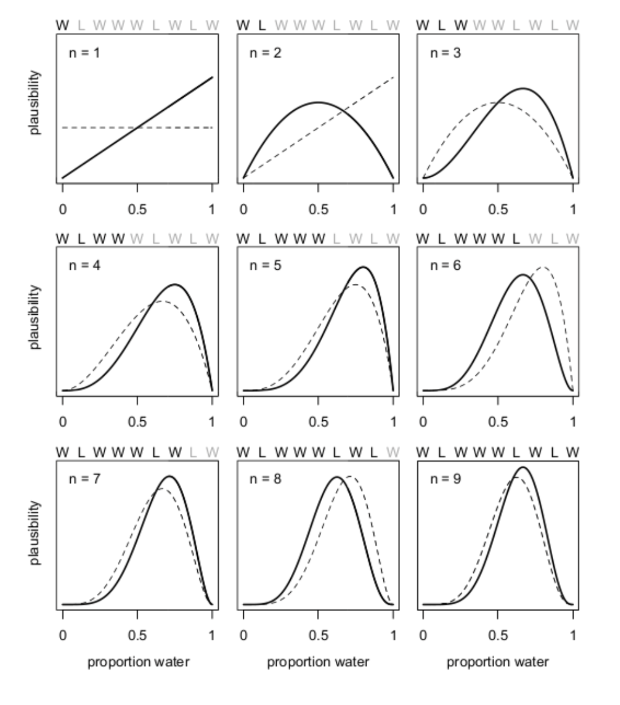
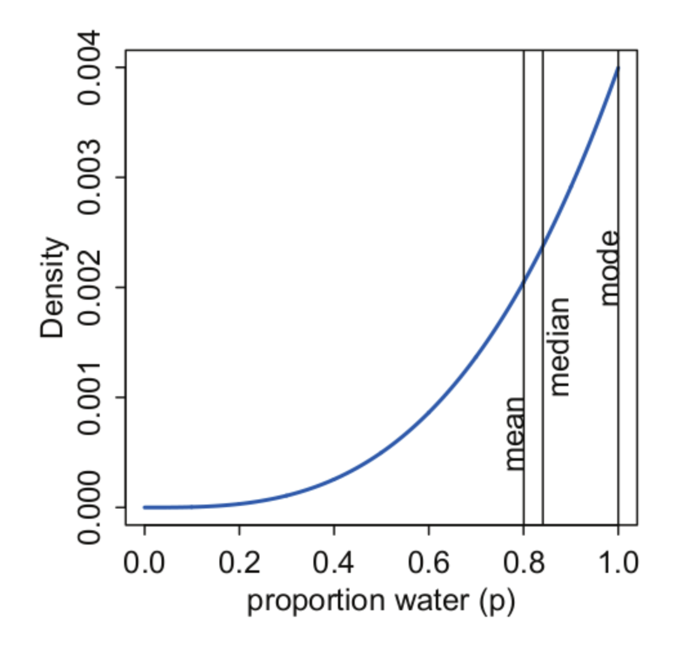

# Bayesian Methods for hackers - PYMC4 snippets  
This is a collection of some snippets founded in the book [Probabilistic Programming and Bayesian Methods for Hackers][14] ported to `pymc4` (`pymc==4.1.2`). The last version of the book (available [online][5] was implemented on `pymc3`, but the library has suffered strong changes in the classes and implementations since then. I have a physical copy of the book and is impossible to follow. I use the `pymc3` notebooks available in the [github repository][5]. 

## Notes in Changelog from pymc3 to pymc4

this are some changes in the API from `pymc3` to `pymc4` that I've being using to port the code from the book:

- `testval` parameter is replaced by `initval`
- `theano.tensor` (`tt`) its replaced by  `aesara.tensor` (`at`)
- `test_value` is (apparently) no longer working. No idea if there is a way to get a value without sampling first. 
- To get values from `trace` from `trace = pm.sample(10000, **args)` use `trace.posterior['var'].values[0]` - old way `trace['var'][15000:]` - 
- try not to use `pm.Metropolis()` (results are not very consistent?) use instead `pm.NUTS()` is a different sampling algorithm, but seems to be more consistent than the other algorithm. 
- for ploting use `arviz` (`import arviz as az`), some of the most common plots and functions:
    - `az.summary(trace)`: a summary table from all the variables, use the arg `var_names` to subset them. 
    - `az.plot_trace(trace, combined=True)`: the main plot that shows the histograms of the parameters in the `trace`
    - `az.plot_forest(trace, combined=True)`: similar to the `plot_trace` but in a compact way
    - `az.plot_posterior(trace, rope=(lb,ub))`: plots only the posteriors from `var_names` and also added the option to plot the `HDI` with a `ROPE` interval probability 
    - [`az.plot_ppc(posterior_samples)`][12]: plot posterior predictive checks, use `pm.sample_posterior_predictive()` function to get the samples 
    - `az.plot_hdi`: TODO
    - `az.plot_autocorr(trace)`: autocorrelation plots, useful to diagnose `mcmc` convergence


# Some Bayesian Inference concepts

*These notes are my own summary from the course of [CC6104 Statistical Thinking][8] which might be a little dense to read as an introduction I highly encourage to watch the videos from that course (**in Spanish**). Also, a more gentle introduction to bayesian inference I recommend this [presentation][9] from Jacob Schreiber* 

The main goal of the bayesian inference is to estimate a `posterior` $f(\theta|d)$ given that we have a `prior` distribution $f(\theta)$ over the parameters $\theta$, a `likelihood` distribution $f(d|\theta)$ and an `evidence` or `average likelihood` $f(d)$ distribution:

$$f(\theta|d) =\frac{f(d|\theta)*f(\theta)}{f(d)}$$

Where $f(d)$ can be calculated using total probabilities  $f(d)= \sum_{\theta}f(d | \theta)*f(\theta)$. This `average likelihood` in the context of the upper formula ( $1/f(d)$ ) it's a "normalization" over the posterior "space". 

In the  Bayesian Inference world we use $f()$ notation to avoid the use of "probability" $\mathbb{P}()$ notation, this is because in the strictly sense they are not the same, but conceptually are very similar (not exactly* but "almost"). 

One difference from the bayesian inference to the "classical" statistical inference is that we are looking to find the "distribution" of the parameter $f(\theta|d)$(`posterior`) rather than finding an "estimator" $\hat{\theta} \sim \theta$ from  a "real parameter value $\theta$ ". Therefore our posterior will provide us with a **distribution** of the parameter, rather than just an **estimator**. 

Usually in the bayesian inference problems we follow the next steps. Assuming that we have a random process to model:

1. We have some prior beliefs on the distributions that generate that process and some priors over the parameters. we call all of them $f(\theta)$ our `priors` (this priors can be (and usually are) nested)
2. Given our "model" of the reality we can estimate a `likelihood` function over the data $f(d|\theta)$ this usually describe how likely is to get our data given that we have a prior from our priors $f(\theta)$
3. We usually don't know the shape or form of the `posterior` distribution, except when we have [conjugate distributions][7] pair, with the `prior` and `likelihood` conjugated. If we  don't have an analytical solution we still can sample from it using the `mcmc` #magic. 
4. We don't care much about the "`evidence`" function, mainly because is hard to estimate (big integral) and there are some properties over `mcmc` that allow us to sample from a "proportionally similar" function rather than the original distribution and still [guarantee convergency](https://github.com/dccuchile/CC6104#part-iii-bayesian-inference). 


We can identify this components in a simple implementation with `pymc` 

```python
import pymc as pm

with pm.Model() as model:
    theta = pm.Exponential("poisson_param", 1.0, initval=0.5) # prior
    obs = pm.Poisson("obs", theta, observed=obs) # likelihood function (the poisson will describe the data distribution given the parameter value) 
    # we sometimes (usually) don't know the shape of the posterior 
    # but we can sample from it using mcmc 
    obs_sim = pm.Poisson("obs_sim", theta) # we usually have to duplicate the likelihood function so we can have a traced sampling from the posterior. This is actually a "posterior predictive distribution (?)"
    trace = pm.sample(1000) # samples of the posterior using MCMC 

```

Even when we set a prior distribution and that assumes some model of the reality, the posterior can look very different -it can be shaped over the weight of the "data" or evidence - and it will be converge too, maybe more slow, but it will be shaped too. 

Actually, in bayesian inference the process of using new data to re-estimate the posterior is called [`bayesian update`](https://github.com/dccuchile/CC6104/blob/master/slides/3_1_ST-bayesian.pdf), and this process can be run indefinitely using the last estimated `posterior` as the new `prior`, and generate a `new posterior` base on it. 

<p align="center"></p>

Once we have "shaped" our priors, and therefore "deduced our posterior" we can do inference. Usually we don't have the actual posterior "formula" but we have a process on how to "sample" from that posterior. The following item is about how to do that
### Notes about doing inference with samples 
*(extracted from [Ch2-3](https://github.com/dccuchile/CC6104/blob/master/slides/3_2_ST-posterior.pdf))*

***Important:** before implementing any of this methods make sure you also read the [the implementation notes](#trace-notes) too*

 If we know the posterior shape, for example after using a conjugate priors, we can estimate easily the areas under the curve using the formula, Although, Given that usually we can't know for sure the shape of the posterior we have to make some hypothesis test over the **sampling** of the posterior. Some common inference sampling procedures are the followings: 
 
1. What is the probability than $\theta \le \theta_{ub}$ ? $\mathbb{P}(\theta \le \theta_{ub})$. 
    
    We count the number of elements in the `trace` that are lower than $\theta_{ub}$ and divided by the elements in the `trace`. Therefore `p ~ len(trace<=ub)/len(trace)`

2. What is the probability that $\theta_{lb} \le \theta \le \theta_{ub}$ ?. $\mathbb{P}(\theta \in [\theta_{lb},\theta_{ub}])$.
 
    We use the estimation of (1) to estimate $\mathbb{P}(\theta \le \theta_{ub})$ and $\mathbb{P}(\theta \le \theta_{lb})$ and then our new estimation $\mathbb{P}(\theta \in [\theta_{lb},\theta_{ub}])$ will be simply the difference between both probabilities

    $$\mathbb{P}(\theta \in [\theta_{lb},\theta_{ub}]) = \mathbb{P}(\theta \le \theta_{ub}) - \mathbb{P}(\theta \le \theta_{lb}) $$


3. What is the $\theta_{ub}$ that we know with $p$ probability that $\theta \le \theta_{ub}$ ?. Find $\theta_{ub}: \mathbb{P}(\theta \le \theta_{ub}) = p$

    We calculate the `np.quantile` where `q=p` for the trace, and that's our $\theta_{ub}$. `qub ~ np.quantile(trace, q=p)`

4. In the Bayesian world the **credible intervals** are the equivalent of the *confidence intervals* in the classical world. They have a very different interpretation thought:

    -  A confidence interval is a region (that will vary depending on the sample) that after infinitely repeating the data sampling experiments will contain the true parameter $(1-\alpha)$ percentage of the time. 

    - In contrast, a **credible interval** is a range of values that **we believe** our parameter can take with a certain probability according to both our prior beliefs and the evidence given by the data.

    The determination procedure for a **credible interval** varies given the posterior shape, if the shape is "symmetrical" using an **equally tailored interval** will be enough. 

    An  **equally tailored interval**  is estimated using the procedure in (3). we basically get both bounds of the interval estimating the tails sizes $\alpha/2$. For example, if $90\% = 1-\alpha$ is our *confidence (credible?) level* ($\alpha = 10\%$, $\alpha/2 = 5\%$ ). therefore, we estimate $\theta_{lb}$ = `np.quantile(trace, q=0.05)` and our $\theta_{ub}$ = `np.quantile(trace, q=0.95)`. Therefore, our **credible interval** $CRI = [\theta_{lb}, \theta_{ub}]$
     
    Nevertheless, sometimes (and very often), our distribution is non-symmetrical or very skew, and is possible that a symmetrical **credible interval** might not even contain the most likely value of $\theta$ (for example when true $\theta$ is in a extreme). In this case we use the **Highest Posterior Density Interval (HPDI)**. The concept behind that interval is basically get *all the possible intervals* with area $1-\alpha$ and choose the one with the narrower interval ($\theta_{ub}-\theta_{lb}:argmin$). 

    when the `posterior` is not skew, HDPI and symmetrical intervals are very similar.

5. What is the mode ?. The highest probability value, also known as the maximum a posteriori (MAP)
    
    `mp = pymc.find_MAP()` apparently this should be called after the `pm.sample()` altho I could't find a "correct" example, apparently this is another "minor" change in the API. Also [other alternatives](https://stackoverflow.com/q/22284502/5318634)

6. What is the mean ? 
    
    `mean = np.mean(trace)`

7. What is the median ? 
    
    `mean = np.median(trace)`
   
   When the posterior is gaussian (or similar), the three indicators (`mean`, `mode`, `median`) tends to be very aligned. that usually don't happen when the distribution is skew. 

    <p align="center"></p>

### Generating "Predictions"

Usually we want to generate simulated data ( $\widetilde{d}$ ) in order to validate our model, and additionally, to get predictions. We want to use our posterior information ( $f(\theta|d)$ ) to do so.

A simple approach would be to use a point estimator of $\theta \sim f(\theta|d)$, for example MAP ( $\theta_{MAP}$ ), insert it on the `likelihood` function $f(d|\theta_{MAP})$, and finally, using that distribution to generate the new data $\widetilde{d}$. The problem with that procedure is that we will ignore the uncertainty in $\theta$ that we have learn from `posterior`. We would like to include that uncertainty in our simulation.  

What we can do is to use many $\theta_{i}$ values , and use them to simulate data using the `likelihood` function $\widetilde{d_i} \leftarrow f(d|\theta_{i})$, then, we would **weight** those simulations $\widetilde{d_i}$ with the probability of getting those  $\theta_i$ from the `posterior`. We call this new distribution the **posterior predictive distribution**, mathematically will be something like $f(\widetilde{d}|d) =\int_{\theta_i} f(\widetilde{d}|\theta_i)f(\theta_i|d) \partial \theta_i$. We basically have an estimation on how likely we can obtain a value $\widetilde{d_i}$ given our posterior. 

An alternative process to estimate the **posterior predictive distribution** is to use a `trace` from the `posterior` (a vector of $\theta_i$'s), and use them to get samples from the `likelihood` function $\widetilde{d_i} \leftarrow f(d|\theta_{i})$ and then simply average them, given that the $\theta_i$ values where already draw using the posterior. 

### How to do this in `pymc` ?

There are two ways to extract a **posterior sampling distribution** one of them is implemented in the snippet above, that consist in duplicating the `likelihood` function but without adding the `observed` parameter, therefore we will have a `trace.posterior['obs_sim']` that will contain simulations of data from the posterior distribution $\widetilde{d_i} \leftarrow f(d|\theta_{i})$. This data samplings conform a **PSD**. 

There is a second method that is using the `pm.sample_posterior_predictive(trace)` [function][11] explained [here][10] which apparently is more efficient than duplicating the `likelihood` variables, but is harder to interpret given than it generates `n_obs` traces (?)

### Implementation Notes (inference with samples) <span id="trace-notes"><span>
 1. **Burned Trace**: When we use a sampling trace to do inference, usually you should drop the `n-first` elements from the `trace` usually known as the `burned_traced` or [*"burn-in period"*][2] because, when we started the `mcmc` algorithm we don't converge to the posterior distribution after we reach some transient state. A good rule of thumbs will be to drop the first `1000` samples or so. In `pymc` the `pm.Sample()` method has the `tune:int=1000` parameter and the `discard_tuned_samples:bool=True` that defines the burn-in period, is by default set to `1000` and discarded. 
  
 2. **Don't mix traces**: The `mcmc` sampling procedure is a sampling over a `n-dimensional` posterior, each one of those `n-dimensions` (associated with `n-parameters`) are not [independent between each other][3], meaning that given a value for $\theta_i$ there is also a more likely $\theta_j$, that means that you should use a trace complete and don't mix multiples sampling results. 

 3. **Use `pm.find_MAP()` as start**. use `pm.find_MAP` as a warm start to reduce convergence times. You can also add a different solver if needed, but the default one has worked fine for me. Also adding the `initval` helps a lot the convergence of the algorithm. 

 4. **Diagnose convergence using autocorrelation**. There is a way to understand if mcmc is converging using [autocorrelation][4]. The basic concept behind is that, when converging the autocorrelation usually drops. you can use the [autocorrelation plot][6] to diagnose. 

### The law of large numbers (The problem with the high variances)

The law of large numbers establishes: 

> The average of a sequence of random variables from the same distribution converges to the expected value of that distribution.

how quick we converge to the expected value of a distribution $\mathbb{E}(Z_i)$. The rate of convergence of $\mathbb{E}(Z_i)$ given a sample of size $N$ will be given by the **Standard Error**: 

$$SE = \frac{ \sqrt{ \; Var(Z) \; } }{\sqrt{N} }$$

where the variance can be estimated using: 

$$\frac{1}{N}\sum_{i=1}^N \;(Z_i - \mu)^2 = Var( Z )$$

where $\mu$ is the estimator for $\mathbb{E}(Z_i)$, therefore, having a sample of $N$ draws, we might know how far are we (on average) from the true expected value. 

This equation ( $SE$ ) "Moivre’s equation" is also known as the ["most dangerous equation"][13]. The main take is that we **shouldn't make inference (or point estimations) when we are dealing with small datasets**. This is not only a problem when our **sample** is small (drawn from a big population), but also when the **population** is small. Imagine a small population that is drawn from a distribution with expected value is $\mu$ the "small-population mean" might be very far from $\mu$, take for example a restaurant ranking with 3 reviews, the "true" rating of the restaurant might be far from the "average" of the reviews. 

[//]: # (References)
[1]: <https://discourse.pymc.io/t/deterministic-with-observables-changes-the-dimensions-of-the-variables-why/10005/5?u=pabloazurduy>
[2]: <https://nbviewer.org/github/CamDavidsonPilon/Probabilistic-Programming-and-Bayesian-Methods-for-Hackers/blob/master/Chapter3_MCMC/Ch3_IntroMCMC_PyMC3.ipynb#Example:-Unsupervised-Clustering-using-a-Mixture-Model:~:text=before%20converge%20the-,burn%2Din%20period,-.> 
[3]: <https://nbviewer.org/github/CamDavidsonPilon/Probabilistic-Programming-and-Bayesian-Methods-for-Hackers/blob/master/Chapter3_MCMC/Ch3_IntroMCMC_PyMC3.ipynb#Important:-Don't-mix-posterior-samples>
[4]: <https://nbviewer.org/github/CamDavidsonPilon/Probabilistic-Programming-and-Bayesian-Methods-for-Hackers/blob/master/Chapter3_MCMC/Ch3_IntroMCMC_PyMC3.ipynb#Autocorrelation>
[5]: <https://github.com/CamDavidsonPilon/Probabilistic-Programming-and-Bayesian-Methods-for-Hackers#pymc3>
[6]: <https://www.pymc.io/projects/examples/en/latest/samplers/DEMetropolisZ_tune_drop_fraction.html?highlight=autocorrelation#autocorrelation>
[7]: <https://en.wikipedia.org/wiki/Conjugate_prior#Table_of_conjugate_distributions>
[8]: <https://github.com/dccuchile/CC6104#part-iii-bayesian-inference>
[9]: <https://www.youtube.com/watch?v=kZPXbZT5stI&t=828s>
[10]: <https://docs.pymc.io/en/v3/pymc-examples/examples/diagnostics_and_criticism/posterior_predictive.html>
[11]:<https://www.pymc.io/projects/docs/en/stable/api/generated/pymc.sample_posterior_predictive.html#pymc.sample_posterior_predictive>
[12]:<https://arviz-devs.github.io/arviz/api/generated/arviz.plot_ppc.html>
[13]:<https://matheusfacure.github.io/python-causality-handbook/03-Stats-Review-The-Most-Dangerous-Equation.html>
[14]:<https://github.com/CamDavidsonPilon/Probabilistic-Programming-and-Bayesian-Methods-for-Hackers>